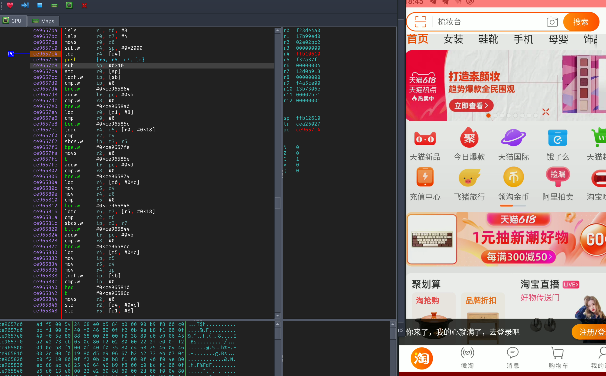

# 安卓调试器 32位




## 执行路劲跟踪
(从上往下，从左往右看哦:)
```c
0x18ae ->memset() 
0x18b6 ->memset() 
0x18ce ->memset() 
0x18ee ->memset() 
0x1904 ->memset() 
0x191a ->memset() 
0x1934 ->memset() 
0x1a06 0x3564   0x3578 0x3a3a8d09 libart@GetObjectArrayElement 
                0x358e 0x3a3a806d libart@GetStringUTFChars 
                0x3592 ->strlen() 
                0x35b8 ->memcpy() 
                0x35d6 0x3a3a8091 libart@ReleaseStringUTFChars 
0x1a10 0x3650   0x365e 0x3a3a8d09 libart@GetObjectArrayElement 
                0x3306 0x3a3a3739 libart@GetObjectClass 
                0x3316 0x3a3a4371 libart@GetMethodID 
                0x3324 0x3a3a447d libart@CallBooleanMethod 
0x1a26 0x3618   0x3626 0x3a3a8d09 libart@GetObjectArrayElement 
                0x326e 0x3a3a3739 libart@GetObjectClass 
                0x327e 0x3a3a4371 libart@GetMethodID libart@CallIntMethod 
0x1a3e 0x3564   0x3578 0x3a3a8d09 libart@GetObjectArrayElement 
                0x358e 0x3a3a806d libart@GetStringUTFChars 
                0x3592 ->strlen() 
                0x35b8 ->memcpy() 
                0x35d6 0x3a3a8091 libart@ReleaseStringUTFChars 
0x1a4a 0x3564   0x3578 0x3a3a8d09 libart@GetObjectArrayElement 
                0x358e 0x3a3a806d libart@GetStringUTFChars 
                0x3592 ->strlen() 
                0x35b8 ->memcpy() 
                0x35d6 0x3a3a8091 libart@ReleaseStringUTFChars 
0x1a5a 0x3564   0x3578 0x3a3a8d09 libart@GetObjectArrayElement 
                0x358e 0x3a3a806d libart@GetStringUTFChars 
                0x3592 ->strlen() 
                0x35b8 ->memcpy() 
                0x35d6 0x3a3a8091 libart@ReleaseStringUTFChars 
0x1a6a 0x3564   0x3578 0x3a3a8d09 libart@GetObjectArrayElement 
0x1a74 0x1ed4   0x1f44 0x1c18   
                0x1f68 0x2450   
                0x204a libsgmainso-6.4.193.so@0xd379 
                0x210c 0x29e0   0x29ee ->strlen() 
                                0x29f6 0x291c   0x292c 0x11b4 libc@malloc 
                                                0x293a ->memset() 
                                                0x2944 0x11b4 libc@malloc 
                                                0x2950 ->memset() 
                                0x2a06 0x2699   
                0x212c libsgmainso-6.4.193.so@0xd379 
                0x2134 0x11b4 libc@malloc 
                0x2144 0x11b4 libc@malloc 
                0x21b2 ->memcpy() 
                0x21c4 ->memcpy() 
                0x21de ->memcpy() 
                0x21fa ->memcpy() 
                0x229e ->memcpy() 
                0x22ea ->memcpy() 
                0x238c 0x2450   
                0x23a0 libsgmainso-6.4.193.so@0xd379 
0x1a7c 0x3da8   0x3db2 0x11b4 libc@malloc 
                0x3dc0 0x4462   0x4262 0x11b4 libc@malloc 
                                0x426e ->memset() 
                                0x4278 0x11b4 libc@malloc 
                                0x4284 ->memset() 
0x1a8e 0x419b   0x41ba 0x11b4 libc@malloc 
                0x41c8 ->memset() 
                0x41ce 0x4570   0x4576 0x4588   0x4592 0x11b4 libc@malloc 
                                                0x459e ->memset() 
                                                0x45a8 0x11b4 libc@malloc 
                                                0x45b4 ->memset() 
                                0x457e 0x450c   0x4518 ->strlen() 
                                                0x44ae ->strlen() 
                                                0x44fc ->memcpy() 
                0x41e2 0x4359   
0x1a9c 0x419b   0x41ba 0x11b4 libc@malloc 
                0x41c8 ->memset() 
                0x41ce 0x4570   0x4576 0x4588   0x4592 0x11b4 libc@malloc 
                                                0x459e ->memset() 
                                                0x45a8 0x11b4 libc@malloc 
                                                0x45b4 ->memset() 
                                0x457e 0x450c   0x4518 ->strlen() 
                                                0x44ae ->strlen() 
                                                0x44fc ->memcpy() 
                0x41e2 0x4359   
0x1aaa 0x419b   0x41ba 0x11b4 libc@malloc 
                0x41c8 ->memset() 
                0x41ce 0x4570   0x4576 0x4588   0x4592 0x11b4 libc@malloc 
                                                0x459e ->memset() 
                                                0x45a8 0x11b4 libc@malloc 
                                                0x45b4 ->memset() 
                                0x457e 0x450c   0x4518 ->strlen() 
                                                0x44ae ->strlen() 
                                                0x44fc ->memcpy() 
                0x41e2 0x4359   
0x1ab8 0x419b   0x41ba 0x11b4 libc@malloc 
                0x41c8 ->memset() 
                0x41ce 0x4570   0x4576 0x4588   0x4592 0x11b4 libc@malloc 
                                                0x459e ->memset() 
                                                0x45a8 0x11b4 libc@malloc 
                                                0x45b4 ->memset() 
                                0x457e 0x450c   0x4518 ->strlen() 
                                                0x44ae ->strlen() 
                                                0x44fc ->memcpy() 
                0x41e2 0x4359   
0x1ac6 0x419b   0x41ba 0x11b4 libc@malloc 
                0x41c8 ->memset() 
                0x41ce 0x4570   0x4576 0x4588   0x4592 0x11b4 libc@malloc 
                                                0x459e ->memset() 
                                                0x45a8 0x11b4 libc@malloc 
                                                0x45b4 ->memset() 
                                0x457e 0x450c   0x4518 ->strlen() 
                                                0x44ae ->strlen() 
                                                0x44fc ->memcpy() 
                0x41e2 0x4359   
0x1ace 0x394c   0x3996 0x3a3a2989 libart@NewObject 
                0x399c 0x2fc0   0x2fce 0x3a3ad641 libart@ExceptionCheck 
                0x39ec 0x2f94   0x2fa2 0x3a3a7439 libart@NewStringUTF 
                                0x2fae 0x3a3ad641 libart@ExceptionCheck 
                0x3a48 0x2f94   0x2fa2 0x3a3a7439 libart@NewStringUTF 
                                0x2fae 0x3a3ad641 libart@ExceptionCheck 
                0x3a66 0x3a3a4395 libart@CallObjectMethod 
                0x3a6c 0x354c libart@DeleteLocalRef 
                0x3a74 0x354c libart@DeleteLocalRef 
                0x39ec 0x2f94   0x2fa2 0x3a3a7439 libart@NewStringUTF 
                                0x2fae 0x3a3ad641 libart@ExceptionCheck 
                0x3a48 0x2f94   0x2fa2 0x3a3a7439 libart@NewStringUTF 
                                0x2fae 0x3a3ad641 libart@ExceptionCheck 
                0x3a66 0x3a3a4395 libart@CallObjectMethod 
                0x3a6c 0x354c libart@DeleteLocalRef 
                0x3a74 0x354c libart@DeleteLocalRef 
                0x39ec 0x2f94   0x2fa2 0x3a3a7439 libart@NewStringUTF 
                                0x2fae 0x3a3ad641 libart@ExceptionCheck 
                0x3a48 0x2f94   0x2fa2 0x3a3a7439 libart@NewStringUTF 
                                0x2fae 0x3a3ad641 libart@ExceptionCheck 
                0x3a66 0x3a3a4395 libart@CallObjectMethod 
                0x3a6c 0x354c libart@DeleteLocalRef 
                0x3a74 0x354c libart@DeleteLocalRef 
                0x39ec 0x2f94   0x2fa2 0x3a3a7439 libart@NewStringUTF 
                                0x2fae 0x3a3ad641 libart@ExceptionCheck 
                0x3a48 0x2f94   0x2fa2 0x3a3a7439 libart@NewStringUTF 
                                0x2fae 0x3a3ad641 libart@ExceptionCheck 
                0x3a66 0x3a3a4395 libart@CallObjectMethod 
                0x3a6c 0x354c libart@DeleteLocalRef 
                0x3a74 0x354c libart@DeleteLocalRef 
                0x39ec 0x2f94   0x2fa2 0x3a3a7439 libart@NewStringUTF 
                                0x2fae 0x3a3ad641 libart@ExceptionCheck 
                0x3a48 0x2f94   0x2fa2 0x3a3a7439 libart@NewStringUTF 
                                0x2fae 0x3a3ad641 libart@ExceptionCheck 
                0x3a66 0x3a3a4395 libart@CallObjectMethod 
                0x3a6c 0x354c libart@DeleteLocalRef 
                0x3a74 0x354c libart@DeleteLocalRef 
0x1b7a 0x2a48   0x2a54 0x1154 libc@free libc@free 
0x1b80 0x2a48   0x2a54 0x1154 libc@free libc@free 
0x1b86 0x2b3a   0x2b46 0x1154 libc@free libc@free 
0x1b8c 0x2b3a   0x2b46 0x1154 libc@free libc@free 
0x1b92 0x2b3a   0x2b46 0x1154 libc@free libc@free 
0x1b98 0x41f0   0x41fc 0x446a   0x4478 0x43c1   0x43e8 0x3e5d   0x3e66 0x461c   0x4628 0x1154 libc@free libc@free libc@free 
                                                0x43e8 0x3e5d   0x3e66 0x461c   0x4628 0x1154 libc@free libc@free libc@free 
                                                0x43e8 0x3e5d   0x3e66 0x461c   0x4628 0x1154 libc@free libc@free libc@free 
                                                0x43e8 0x3e5d   0x3e66 0x461c   0x4628 0x1154 libc@free libc@free libc@free 
                                                0x43e8 0x3e5d   0x3e66 0x461c   0x4628 0x1154 libc@free libc@free libc@free 
                                0x447c 0x1154 libc@free libc@free libc@free@plt-unkown pc: 0x1bba next: 0xb48502e1 
```


# NOTE:
弃坑 
开发64位中
